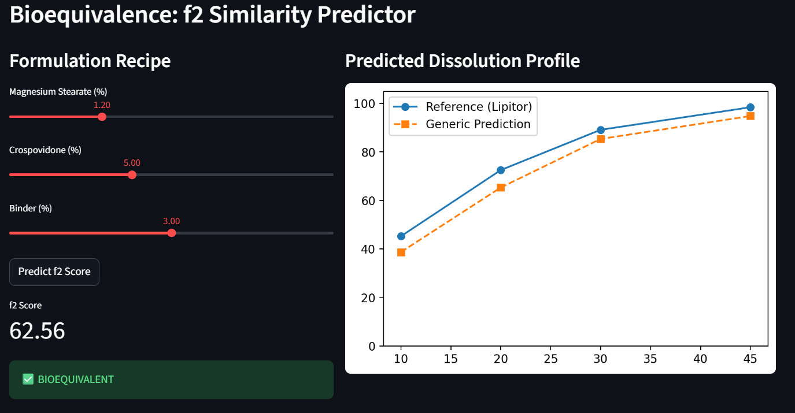
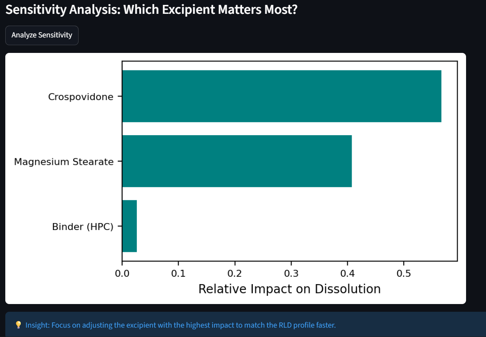
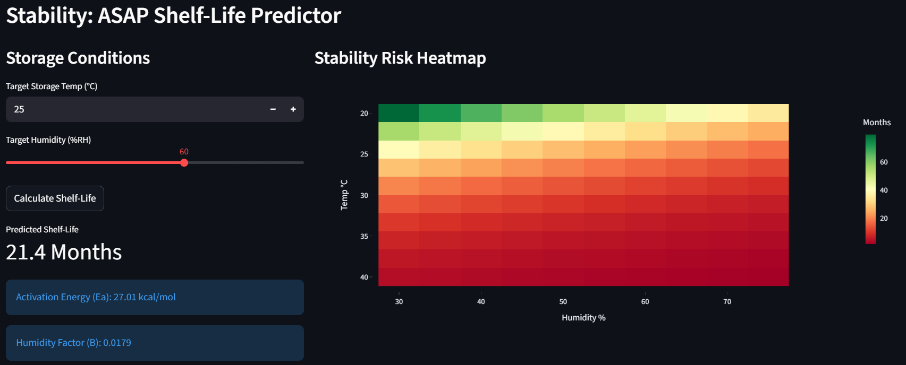

# 🚀 ANDA Launch Accelerator: Digital Triage Suite
### AI-Driven Bioequivalence, Stability, and Safety Optimization for Generic Pharma

[](https://www.python.org/downloads/)
[](https://fastapi.tiangolo.com/)
[](https://streamlit.io/)

## 📌 Executive Summary
In the generic pharmaceutical industry, the "First to File" advantage is determined by the speed of the **Abbreviated New Drug Application (ANDA)** process. This suite demonstrates how Machine Learning can compress the development timeline by replacing months of iterative laboratory "trial-and-error" with **In Silico** modeling.

This project focuses on **Atorvastatin (Lipitor)** as a case study, addressing the three critical regulatory pillars: **Bioequivalence, Stability, and Safety.**

---

## 🛠 Digital Triage Pillars

### 1. Bioequivalence: Dissolution $f_2$ Matcher
* **The Problem:** Achieving a dissolution profile similar to the Reference Listed Drug (RLD) often requires 10+ physical batch iterations.
* **The Solution:** A **Multi-output Random Forest Regressor** trained on virtual formulation data (CMAs like Magnesium Stearate and Crospovidone).
* **Value:** Predicts the **$f_2$ Similarity Factor** in real-time. Includes **Sensitivity Analysis** to identify which excipient is the primary bottleneck for equivalence.

<p align="center">
   <br>
    <br>
   Figure 1: Real-time f2 calculation and profile comparison.<br>
   <br>
    <br>
   Figure 2: Identify the high-impact excipient.
</p>   
   
### 2. Stability: ASAP Shelf-Life Predictor
* **The Problem:** Traditional ICH stability studies require 6 months of data for a submission.
* **The Solution:** Implements the **Humidity-Modified Arrhenius Equation** using Linear Regression.
* **Value:** Uses 2-week "isoconversion" stress data to project a 24-month shelf life. Enables high-confidence primary packaging selection 5 months ahead of schedule.

<p align="center">
   <br>
    <br>
   Figure 3: Heatmap analysis showing shelf-life sensitivity to storage conditions.<br>
   <br>
</p>  

### 3. Safety: Automated Impurity Identification
* **The Problem:** "Unknown" peaks in LC-MS data trigger OOS investigations that stall filings.
* **The Solution:** A spectral fingerprint matcher using **Cosine Similarity**.
* **Value:** Instantly cross-references lab results against known degradant libraries to mitigate regulatory risk.

---

## 🏗️ System Architecture
* **Backend:** FastAPI (Python) serving as the Analytical Engine.
* **Frontend:** Streamlit providing a "Control Center" for formulation scientists.
* **Data Science:** Scikit-learn, RDKit, NumPy, Matplotlib, Plotly.
* **Database:** PostgreSQL (Integration ready for RWE storage).


---

## 🚀 Getting Started

1. **Clone the Repo:**
   ```bash
   git clone [https://github.com/your-username/anda-launch-accelerator.git](https://github.com/your-username/anda-launch-accelerator.git)
   cd anda-launch-accelerator

2. Install Dependencies:
   ```bash
   pip install -r requirements.txt

3. Run the Suite:
   ```bash
    Terminal 1 (Backend): uvicorn backend:app --reload
    Terminal 2 (Frontend): streamlit run frontend.py
  

📈 Quality by Design (QbD) Alignment
This suite is built in accordance with ICH Q8 (Pharmaceutical Development) and ICH Q9 (Quality Risk Management) guidelines, ensuring that ML insights are framed within a valid regulatory context.

Contact: Manish Patel
 
